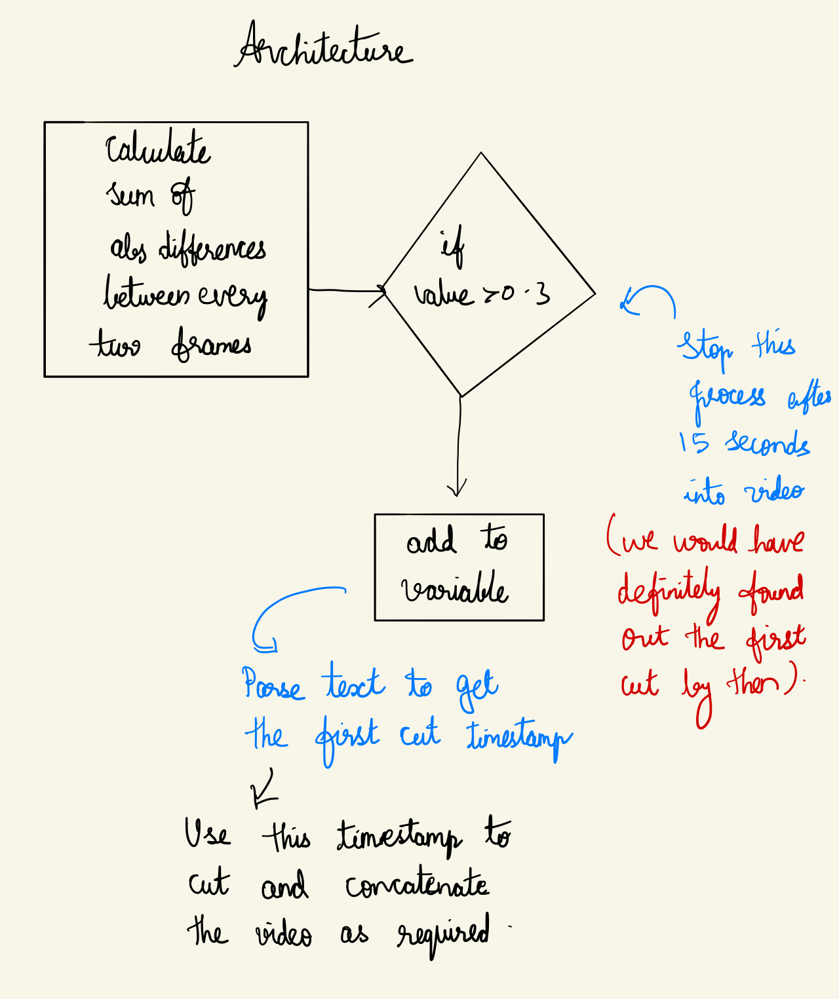

# How I automated my part time job after getting bored of it
I am working part time as a video editor for a department at my college (ASU). The journey with the team has been exciting and pushed me to learn things that I do not know. I have learnt to use Davinci resolve, illustrator, after effects and many more things. 

But, when the first project was done, there was a small gap where I was assigned a project with repetitive tasks. Here I was supposed to remove titles and add a new montage over and over for 120+ videos.


# How does the method work?


<!---   --->

## Step 1: use scene detect to find the timestamp of the video where the titles ended.
a.Initially I did the scene change detection for the entire video, this was clearly a waste of time. So I could only apply the detection for first 15 seconds of the video before which both montage and title would end.

```
video_information=$(ffmpeg -i "$NAME" -filter_complex "select='gt(scene,0.3)',metadata=print:file=-"  -vsync vfr slidesnap%03d.png 2>&1 2>/dev/null)
```
b.Start seek parameter was passed before the filter so that we could save some time
```
video_information=$(ffmpeg -i "$NAME" -ss 0 -t 15 -filter_complex "select='gt(scene,0.3)',metadata=print:file=-"  -vsync vfr slidesnap%03d.png 2>&1 2>/dev/null)
```
c.The output from above ffmpeg code is stored into video_information variable which will be useful to cut the video. 

## Step 2: Use the scene change text file and parse the timestamp.
Some videos only had title, so I took the first timestamp where the scene change was detected.
Some videos had both montage and title. Here I took the second time from the scene change list.
## Step 3: Now we will remove the frames till the timestamp that we extracted above and add the montage video to it.[1]
We can remove the first few frames in two ways input seeking and output seeking.
To use input seeking we place the -ss parameter before -i parameter in our script and incase of output seeking we use -ss parameter after the – parameter
``` Input seeking: ffmpeg -ss 00:23:00 -i Mononoke.Hime.mkv -frames:v 1 out1.jpg
Output seeking: ffmpeg -i Mononoke.Hime.mkv -ss 00:23:00 -frames:v 1 out2.jpg 
```
The input seeking method works faster by using key frames whereas the output seeking method decodes and discards each frame till reaches the specified time stamp. Previously input seek was not accurate, but since it is accurate now, we use input seeking method.
We don’t follow this step 3 directly, but we use it in combination with the steps below.
## Step 4:  Then we concatenate the montage video that we have already cut using a single line ffmpeg command.[2]
There are three methods to concatenate videos. The first two methods work when the files to be concatenated use the same codec. The third one works even when the codecs are different.
The concat demuxer and concat protocol methods work when all the files to be concatenated are of same format. The demuxer works at stream level whereas the protocol works on file level.
The montage video we use here is in the same format as the other videos. Even if it is not in the same format, we can convert it to the same format using ffmpeg.
In our first attempt, we use the concat protocol and create intermediate files to cut and concatenate the videos.
```	ffmpeg -i montage.mp4 -qscale:v 1 intermediate1.mpg 
	ffmpeg -i "$NAME" -qscale:v 1 intermediate2.mpg 
	ffmpeg -i concat:"intermediate1.mpg|intermediate2.mpg" -c copy intermediate_all.mpg 
	ffmpeg -i intermediate_all.mpg -qscale:v 2 output.mp4 	
```
Creating intermediate files is slow and unnecessary, so we now use pipes to avoid intermediate files.
```	mkfifo temp1 temp2
	ffmpeg -y -i Montage3.mp4 -c copy -bsf:v h264_mp4toannexb -f mpegts temp1 2> /dev/null & \
	ffmpeg -y -ss "$ts" -i "$NAME" -c copy -bsf:v h264_mp4toannexb -f mpegts temp2 2> /dev/null & \
	ffmpeg -f mpegts -i "concat:temp1|temp2" -c copy -bsf:a aac_adtstoasc outputs/"$NAME2" 
```
In this method, we use mpegts container format for our intermediate temp files and then finally concatenate the output file back to mp4 container format.
While concatenating, instead of concatenating the entire file, we seek to the relevant timestamp and then concatenate, this allows us to avoid an another file for removing the initial frames with text.
In the above script temp1 2> /dev/null &, we are redirecting the output to null so that we do not clutter/hang the terminal.

## How scene detect works?[3]
  Ffmpeg uses the Sum of absolute differences method to compare consecutive frames. As we compare only frames till 15 seconds, the amount of time to find the first cut is also reduced. 
  
<!---  --->


### To save list of video names as text file, we use the following command.
```
dir /b /a-d > filename.txt
```
I use this command to get all the file names and import it to excel, this was it will be easier for me to check how many videos have been cut correctly and how many of them have been done wrong.
To count the no of cell having the word “pass”, I use the following excel formula:
```
=COUNTIF([status],"fail")
```
Where status is the column I am applying the string count program on.
## How many videos did our script work correctly on?
On 91 videos of the 125-total video, the program worked correctly. For the remaining 34 videos, I still had to edit the videos manually.


## Why some of the videos weren’t cut properly?
The videos for which the script did not work properly have crossdissolves or fades between title and the person entrance. This causes the sse method of the ffmpeg to not work as expected.

## Issues while concatenating videos
When concatenating video using the concat protocol of ffmpeg, it is required that the videos belong to same container. When the script was run for first time, the authors voice pitch went up. Given that the container format of both the videos were same, this issue seemed tough to tackle. But when I noticed the bitrate and sample rate of both the files. They were different, after this was fixed using handbrake(UI over ffmpeg) the issue is resolved.

## Permissions
To run our script, we give executable permission to the file using the following command
```
chmod +x filename
``` 
## Remove intermediate files
In the above process, ffmpeg also outputs the snapshot of the frame where the scene is cut automatically. When we run the script for 125 videos, the folder gets cluttered with snapshots of these frames. So I add rm slidesnap* to remove the file as soon as it is added to the folder. Similarly, I also remove the temp1 and temp 2 using rm temp1, rm temp2 to the script.
## Complete script

```
FILES=inputs/*
for filename in $FILES 
    do 
        NAME=$(echo "${filename}"); 
    	echo $NAME
    	NAME2=$(echo "$NAME" | cut -c 8-)
    	echo $NAME2
    
       
video_information=$(ffmpeg -i "$NAME" -ss 0 -t 15 -filter_complex "select='gt(scene,0.9)',metadata=print:file=-"  -vsync vfr slidesnap%03d.png 2>&1 2>/dev/null)

echo "$video_information"  
count=0
while read -r line;do
    for word in $line; do
   	if [[ $word == pts_time:* ]]; then
   	    ((count=count+1))
   	    if [[   count==1 ]]; then
    	    	ts=$(echo $word | cut -c10-15)
    	    	break 2
    	    fi
    	fi	
    done
done <<< "$video_information"
mkfifo temp1 temp2
ffmpeg -y -i Montage3.mp4 -c copy -bsf:v h264_mp4toannexb -f mpegts temp1 2> /dev/null & \
ffmpeg -y -ss "$ts" -i "$NAME" -c copy -bsf:v h264_mp4toannexb -f mpegts temp2 2> /dev/null & \
ffmpeg -f mpegts -i "concat:temp1|temp2" -c copy -bsf:a aac_adtstoasc outputs/"$NAME2"

rm temp1
rm temp2

done
```
# Conclusion
In conclusion, I was able to automate the editing of 91 videos out of 125 videos. Since there is no guarantee that this method will definitely work, you need to check every video and manually edit the videos that did not come out as expected. Ffmpeg uses sum of squared differences to detect scene changes and this does not work with cross dissolves and fades. There are other methods which work well in these cases and is not added to ffmpeg. Hopefully I can contribute to ffmpeg by adding such method one day. 
Ending notes:
I learnt a lot about writing shell scripts, pipes and about ffmpeg while I took up this challenge. I challenge the readers to try to automate parts of their job and share their experiences along the way. Would love to hear more such stories. Let me know your thoughts below. 
# References:
1.	https://trac.ffmpeg.org/wiki/Seeking
2.	https://trac.ffmpeg.org/wiki/Concatenate
3.	http://www.ffmpeg.org/ffmpeg-filters.html#select_002c-aselect
